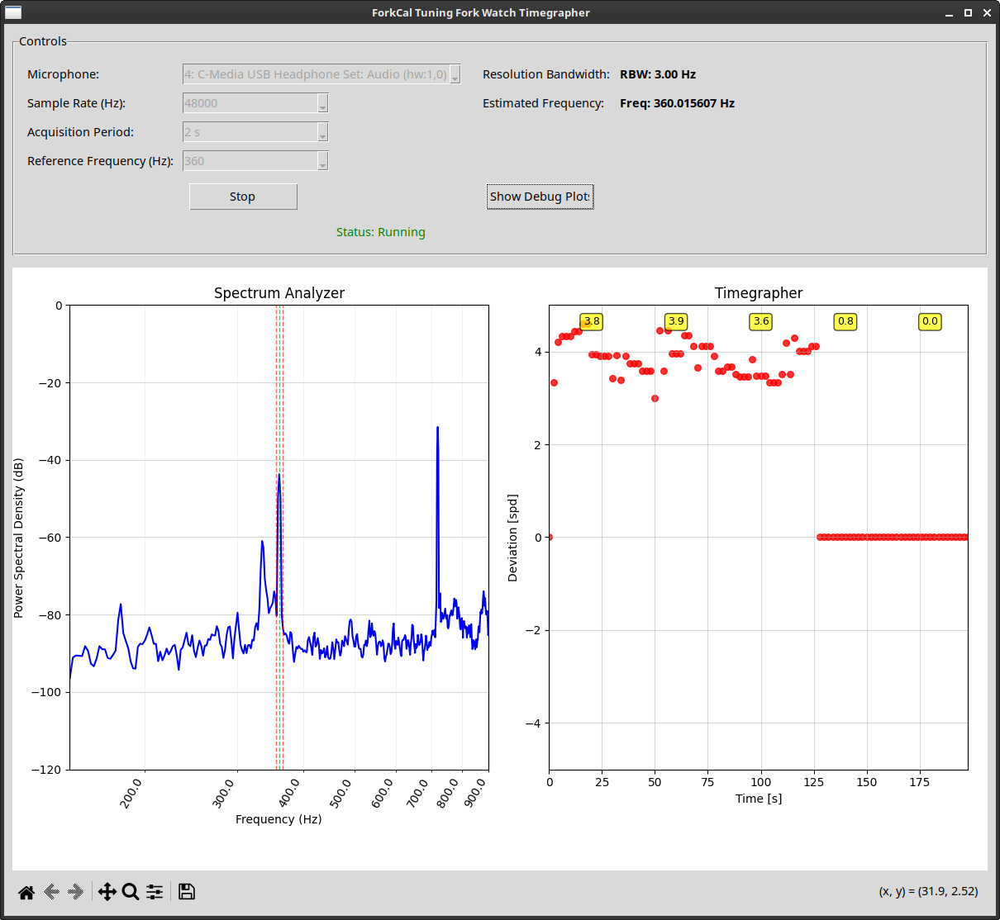

# ForkCal
Tuning fork watch timegrapher for Bulova Accutron and ETA movements, such as Omega f300, etc.

    

## Hardware Requirements
This timegrapher software is intended to be used with an *inexpensive* USB timegrapher such as these:
- https://www.amazon.com/s?k=usb+timegrapher
- https://www.aliexpress.us/w/wholesale-usb-timegrapher.html

## Software Requirements
Only tested on Linux, but may run on other operating systems. I assume you are running a Debian-based OS like Ubuntu. To run on other distributions, simply install the required packages using your package manager.

## Installation and launch
- sudo apt-get install python3-pyaudio portaudio19-dev
- pip install -r requirements.txt
- python3 forkcal.py

## Instructions
Select the reference frequency for your movement, which is the frequency of the tuning fork. Early Accutrons run at 360 Hz, while the later ETA movements such as the Omega f300 run at 300 Hz.
Also, for good accuracy, you should set the acquisition period to the longest duration possible, such as 10 seconds or more. 
On some watches, the second harmonic of the oscillation frequnecy is actually stronger and clearer (higher SNR) than the fundamental mode. For example, on my Accutron 214, the signal at 2*360 Hz = 720 Hz is much stronger on my cheap USB timegrapher. Therefore, I can get better accuracy and performance by selecting a reference frequency of 720 Hz instead of 360 Hz.

## Theory of Operation
An audio signal is recorded for the acquisition period (e.g. 10 seconds). A spectrogram is displayed but is not part of the timegrapher calculation. Instead, the frequency estimate is performed by:
- Bandpass filters the recorded signal around the reference frequency using a high order FIR filter
- Crop the filtered signal to ~15% to ~85% of the time duration.
- Fit a sine wave of the form A*sin(2*pi*f_fit + phi) to the filtered and cropped signal.
  - Residual fitting error in excess of 5% raises an error and the fit and measurement are discarded.
- Compute the frequency deviation (error) between the fit and the reference frequency, deltaF = f_ref - f_fit
- Convert frequency deviation to error in seconds per day as: SPD = deltaF/f_ref * 24*60^2
- A median filter of length 3 is applied to the timegrapher plot.

The accuracy is determined by three factors, the acquisition period (longer the better), the signal to noise ratio (SNR) of the recording circuit and the time stability of the crystal in the USB timegrapher. Even though the USB timegrapher is cheap, is still has at least a basic quartz crystal, probably around 20 ppm or 1.7 seconds per day (spd). It may be possible to improve this by soldering in an OCXO or higher quality TCXO. This is a future project. 

Regarding the SNR of the USB timegrapher, I noticed that the flashing red LED generates an electrical noise that is picked up. Cutting the LED leads eliminates this noise and can improve performance. Placing the device in a quite room or inside an insulated box can reduce ambient noise. 

## Credits and License
Developed by joncox123 using Claude AI. All rights reserved.
