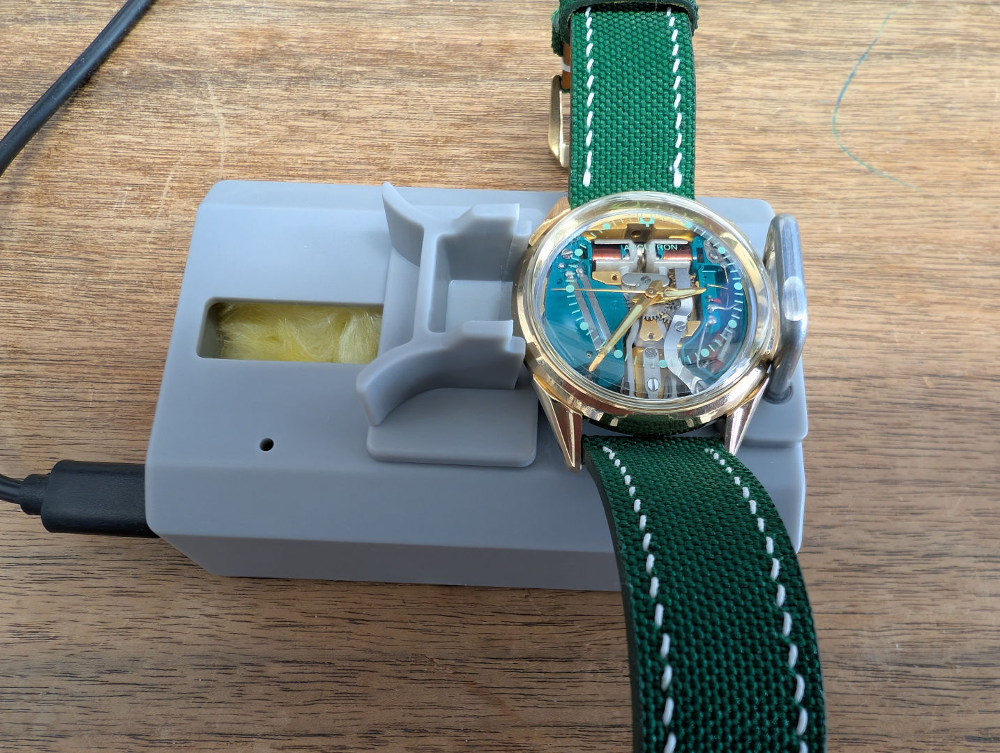
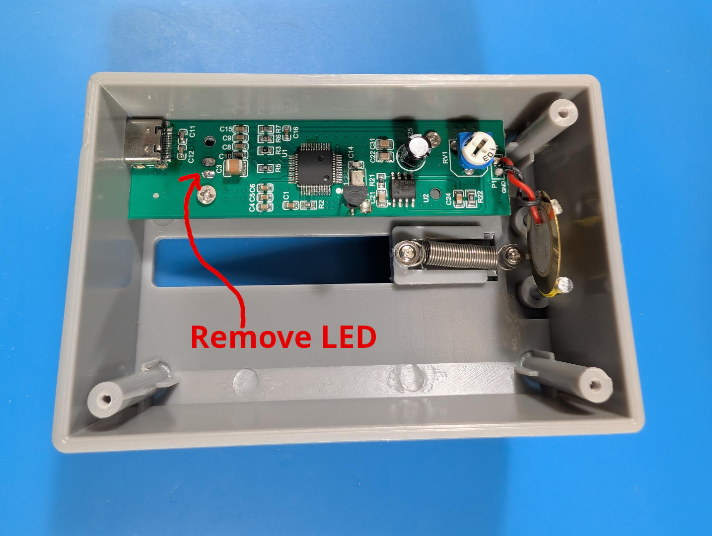
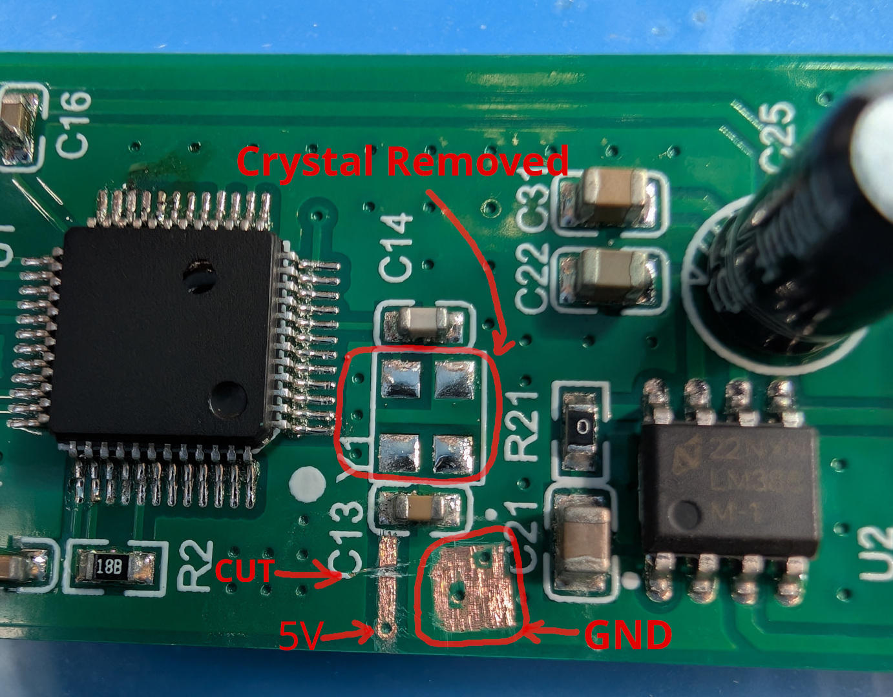
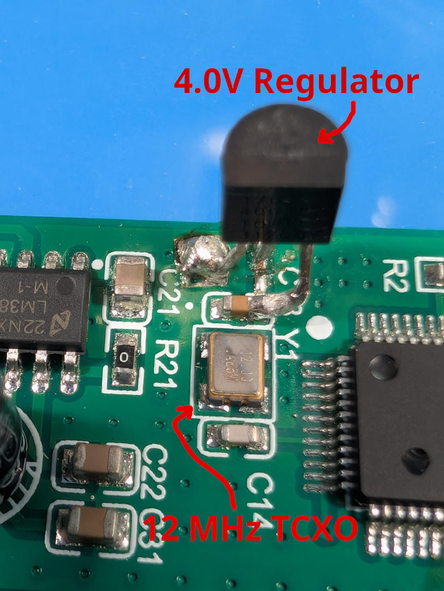

## Modifying a Cheap USB Timegrapher for Commercial-grade Performance

USB timegraphers, actually peizoelectric disc microphones with USB digitizers, are widely available on the internet, but how good are they?
Out of the box, their performance is probably good enough for most amateur purposes, especially for mechanical watch movements that are often regulated only to about +/-5 seconds per day (spd).
However, for a tuning fork movement, which needs regulation to much better than that, the performance is not good enough.

The timing performance is determined by the following factors:
- Timing precision of the quartz crystal oscillator in the timegrapher being used to digitize the audio signal.
 - A faster or slower *real* sampling rate (e.g. 44 kHz reported but 43.999 kHz in reality) will directly impact the measured frequency leading to timegrapher error.
- The background noise level, both acoustic and electrical that is picked up.
- The quality of the signal processing in the timegrapher software (e.g. ForkCal), with a lower bound set by the measurement duration.

    

### Improving the Crystal Oscillator with a TCXO
The stock crystal is a non-temperature compensated, 12.0 MHz oscillator with +/-50 ppm accuracy. To convert this to an equivalent error in seconds per day (spd), use the following formula:
spd = PPM * 1e-6 * 24*60^2, which is simply the fractional error multiplied by the number of seconds in a day. Thus, the error range with a 50 ppm crystal can be +/-4.3 spd! This is hardly good enough for a tuning fork watch, let alone COSC level regulation of a mechanical watch.

Fortunately, it is a relatively simple matter to replace the crystal with a much more accurate, temperature compensated crystal, known as a [Temperature Compensated Crystal Oscillator (TCXO)](https://en.wikipedia.org/wiki/Crystal_oscillator#Temperature). The circuit in the USB timegrapher runs at 5.0 V, but there are no TCXOs available that are related to 5 VDC. The highest available is only 3.6V.
However, to reliably drive the 5V logic of the microcontroller on the board, we can regulate the 5.0V supply down to 4.0V, which is close enough to provide both reliable and stable operation.
Then we can simply swap the 50 ppm crystal with another crystal that is identical in size and pinout, but only 2.5 ppm with temperature compensation.

### Lowering the Background Noise
One obvious design flaw in the USB timegrapher is the design and layout of the LED driver circuit, which flashes the LED when it is recording.
The abrupt current pulses cause noise impulses on the audio input at roughly once per second. The easy solution is to desolder and remove the LED.
Fortunately, the LED really isn't necessary because both Windows and Linux indicate the attached microphones and show when they are recording--so the LED is pointless anyway.

However, acoustic background noise is also an issue due to the cheap plastic case without any sound proofing. Moreover, the top of the case, where the spring-loaded clamp slides back and forth, is completely exposed and unsealed--unlike a professional timegrapher.
As a result, any noise from the environment can propagate inside and strike the piezo disc, coupling into the audio signal measurement. A good solution is to stuff soft fiberglass insulation into the case to dampen sound.

## Modifications

### Parts

You will need to order two parts, a 2.5 ppm TCXO and a 4.0 V linear regulator. Please consult the PDF data sheets for pinouts and information about these parts.
- [TCXO Part #: ASTX-H11-12.000MHZ-T, **2.5 ppm model**](https://www.digikey.com/en/products/detail/abracon-llc/ASTX-H11-12-000MHZ-T/3641089)
- [4.0V Linear Regulator Part #: MCP1702-4002E/TO](https://www.digikey.com/en/products/detail/microchip-technology/MCP1702-4002E-TO/2179270)

### Step-by-step Instructions

First, open the bottom of the case by removing the three small screws under the padded, stick-on feet.
Then free the circuit board (PCB) by removing the two small screws holding it to the plastic standoffs.
**Be carefully not to pull too hard or you will break the wires connecting the piezo disc to the PCB!**
Carefully desolder the black and red piezo leads from the PCB and remove the board.

Second, use a soldering iron to desolder and remove the LED (the clear plastic "bulb" near the USB-C connector) by heating the two leads from the underside and rocking it out.

    

Third, using a reflow soldering station with hot air gun for surface-mount electronics, heat up the existing crystal and carefully remove it with tweezers.
You want to do this quickly, within a couple of minutes, to avoid damage.
I recommend setting the heating plate to 225 °C from the bottom and then use hot air at 400 °C from the top, directly right above the crystal with a small nozel.

Fourth, once you have removed the crystal, use a sharp [X-acto knife](https://en.wikipedia.org/wiki/X-Acto) or similar to *carefully* scrape off just the green solder resist, exposing the bare coper below.
It helps to have a microscope, but it is not required. Then, clean the copper with some alcohol and "tin" the surface with a soldering iron and solder to protect it from oxidation.

    

Fifth, apply a little solder paste to the four surface mount pads where the new TCXO will be installed.
This helps hold the new crystal in place during heating and helps the old solder reflow onto the pads of the TCXO package more easily.
Drop the new crystal in, *making sure it is oriented exactly as shown in the pictures,* and not upside down.
Place it on the hot plate, let it warm up for a couple of minutes, then hit it with the hot air for about 20 to 30 seconds.
You will see the solder turn shiny and the TCXO get sucked down a bit when the solder has reflowed and melted.

Sixth, trim the leads of the 4.0V regulator to about 1.5 cm. Bend each lead using some small pliers so that the V-in, V-out and Ground leads will exactly touch the 5.0V, SMD capacitor and the ground pad, respectively.
Look at the datasheet for a clear diagram of which lead corresponds to which function (V-in, V-out, GND). The orientation should be as shown in the picture.

Seventh, using a soldering iron and some tweezers, press the ground lead into the big pad that you made and solder it in place. Then do the same for the 5.0V V-in lead.
Finally, solder the 4.0V V-out lead to the edge of the SMD capacitor with a fine tip soldering iron. 

    

Eighth, solder the piezo disc leads back to the PCB, making sure not to reverse the polarity.
Its easier to solder them to the top of the PCB instead of trying to get the small wires back through the PCB vias, but either approach is fine.
Mount the PCB back in the enclosure, but do not close the bottom lid yet.

Nineth, obtain some soft fiberglass insulation, such as is commonly used to insulate walls in houses or to wrap pipes. Cut a rectangle the size of the enclosure and stuff it inside.
You want it to be somewhat packed, but not too packed. Finally, reinstall the bottom cover, stick the foam feet back on and you are done!

You now have an extremely accurate, high quality, professional grade USB timegrapher for both mechanical and tuning fork watches!
